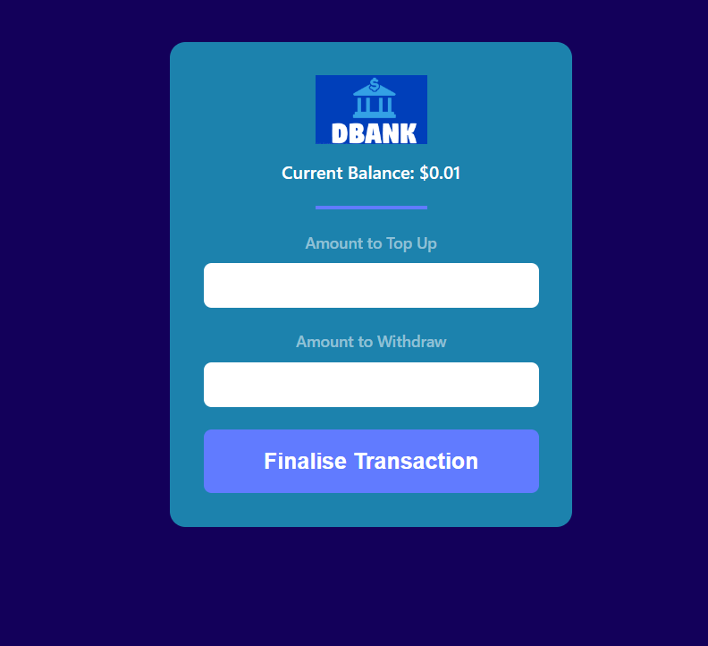
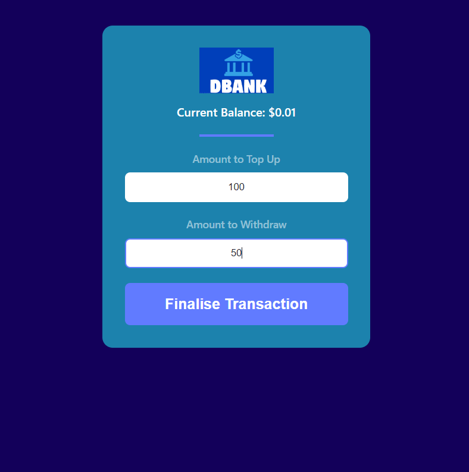
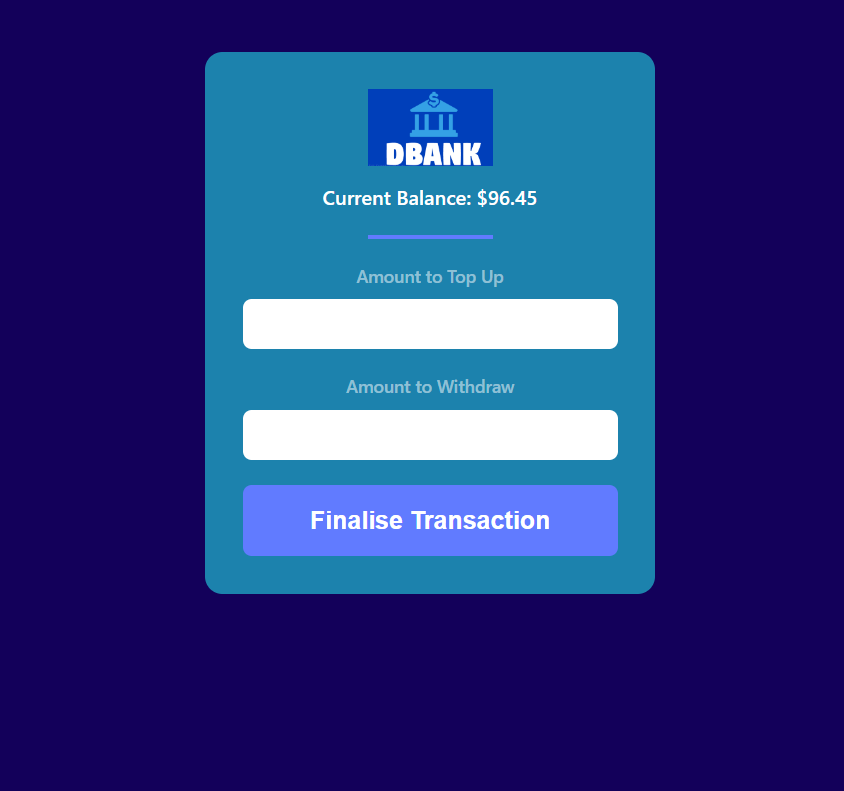

# dbank_02
This is a banking app where the user starts with a deposit of $300  and can perform transactions by adding and taking out money. Each time the user performs a transaction, the sum will be added together by the time between transactions; this is implemented on the backend side with Motoko to show the functionality of additional transactions.


If you want to start working on your project right away, you might want to try the following commands:

```bash
cd dbank_02/
dfx help
dfx canister --help
```

## Running the project locally

If you want to test your project locally, you can use the following commands:

```bash
# Starts the replica, running in the background
dfx start --background

# Deploys your canisters to the replica and generates your candid interface
dfx deploy
```

Once the job completes, your application will be available at `http://localhost:4943?canisterId={asset_canister_id}`.

Additionally, if you are making frontend changes, you can start a development server with

```bash
npm start
```

Which will start a server at `http://localhost:8080`, proxying API requests to the replica at port 4943.

### Note on frontend environment variables

If you are hosting frontend code somewhere without using DFX, you may need to make one of the following adjustments to ensure your project does not fetch the root key in production:

- set`NODE_ENV` to `production` if you are using Webpack
- use your own preferred method to replace `process.env.NODE_ENV` in the autogenerated declarations
- Write your own `createActor` constructor


---


**Examples of views from the website:**</br>

---

</br>

---

</br>


---

</br>