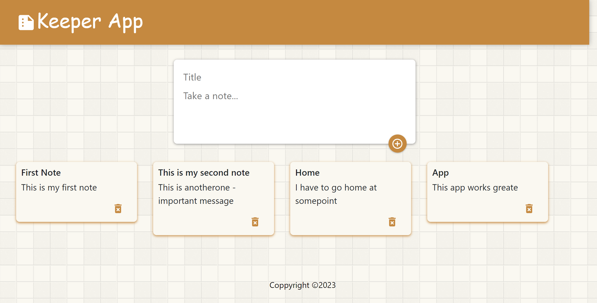

# dkeeper_app_03
This web app presents the option of making dynamic lists. On the home page, the user will see an input saying "Take a note..." and after navigating the cursor in this field, the note will expand and give the option for the user to fill in the title and the content of the note. With a plus button, the note can be added to the home page. Each note that was added can also be deleted with the "trash bin" button. This decentralized app shows how to connect frontend developed with React.js and backend developed in motoko (Interent Computer). All data is stored and manged on a canister, and after refreshing the website it will still be availabe because it is stored on the backend. 


If you want to start working on your project right away, you might want to try the following commands:

```bash
cd dbank_02/
dfx help
dfx canister --help
```

## Running the project locally

If you want to test your project locally, you can use the following commands:

```bash
# Starts the replica, running in the background
dfx start --background

# Deploys your canisters to the replica and generates your candid interface
dfx deploy
```

Once the job completes, your application will be available at `http://localhost:4943?canisterId={asset_canister_id}`.

Additionally, if you are making frontend changes, you can start a development server with

```bash
npm start
```

Which will start a server at `http://localhost:8080`, proxying API requests to the replica at port 4943.

### Note on frontend environment variables

If you are hosting frontend code somewhere without using DFX, you may need to make one of the following adjustments to ensure your project does not fetch the root key in production:

- set`NODE_ENV` to `production` if you are using Webpack
- use your own preferred method to replace `process.env.NODE_ENV` in the autogenerated declarations
- Write your own `createActor` constructor


---


**Examples of views from the website:**</br>

---

</br>

---

</br>

---

</br>


---

</br>