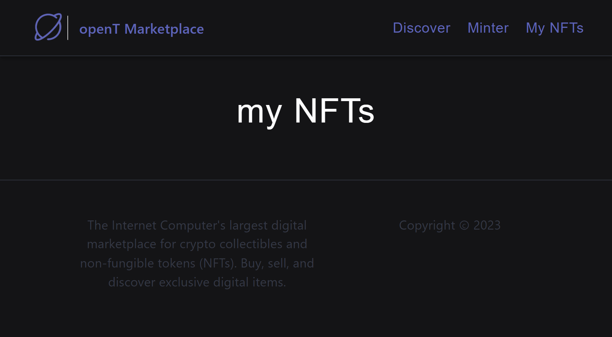
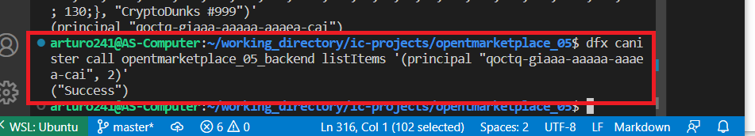

# opentmarketplace_05 

Copyright 2023 

The code in this tutorial project is licended under the Apache License, Version 2.0 (the "License");
you may not use this project except in compliance with the License.
You may obtain a copy of the License at

    http://www.apache.org/licenses/LICENSE-2.0 
 
Unless required by applicable law or agreed to in writing, software
distributed under the License is distributed on an "AS IS" BASIS,
WITHOUT WARRANTIES OR CONDITIONS OF ANY KIND, either express or implied.
See the License for the specific language governing permissions and
limitations under the License.

Here is the TL;DR version of the above licence:
https://tldrlegal.com/license/apache-license-2.0-(apache-2.0)


--- 
 

This project will imitate most of the functionality of the OpenSea website, where users can mint, list, and sell NFTs (non-fungible tokens) on ICP.
It is basically like a NFT e-commerce site. It is a very complex project built with React.js on the frontend and Motoko and the Internet Computer on the backend. The final website, the "Open Market Place" has a lot of features. There is a section (route: /collection ) where we can view the NFTs that the user owns, and the user can sell these NFTs by clicking on "sell" and then setting a price in ARTURIONS, the ARTURION coin, which anyone can claim now from the previous project (these are the tokens created with the previous project token_04 - which is required to distribute the tokens and use them to buy on the website). Once these items are sold, you will be able to see them on the /discover route, where they are listed for people to buy. You cannot purchase an item that you have listed for sale, but you may purchase items owned by others. You will be able to only pay in ARTURION coins, and you will be able to purchase these individual NFTs, which you will then see. There is also the option of minting your own NFTs, which will result in a unique canister on the Internet Computer blockchain. The canisters will contain all of the data for your image file that you just minted. And once they are minted, you will be able to see them in your collection. You will have the option of keeping them or listing them for sale. This is a perfect example of creating canisters, buying and selling NFTs through the transfer of third party tokens (here we will use the ARTURION coins, that we created early on), and managing all of the e-commerce requirements of the website. In order to use this project, it is imperative that you first finish and make sure the previous project is working (token_04), because we will use the tokens (ARTURIONS) created in that project to buy NFTs on our website. The images you can mint are in the CryptoDunks folder; of course, you can add more. 


---


To learn more before you start working with opentmarketplace_05, see the following documentation available online:

- [Quick Start](https://internetcomputer.org/docs/current/developer-docs/quickstart/hello10mins)
- [SDK Developer Tools](https://internetcomputer.org/docs/current/developer-docs/build/install-upgrade-remove)
- [Motoko Programming Language Guide](https://internetcomputer.org/docs/current/developer-docs/build/cdks/motoko-dfinity/motoko/)
- [Motoko Language Quick Reference](https://internetcomputer.org/docs/current/references/motoko-ref/)
- [JavaScript API Reference](https://erxue-5aaaa-aaaab-qaagq-cai.raw.ic0.app)

If you want to start working on your project right away, you might want to try the following commands:

```bash
cd opentmarketplace_05/
dfx help
dfx canister --help
```

## Running the project locally

If you want to test your project locally, you can use the following commands:

```bash
# Starts the replica, running in the background
dfx start --background

# Deploys your canisters to the replica and generates your candid interface
dfx deploy
```

Once the job completes, your application will be available at `http://localhost:4943?canisterId={asset_canister_id}`.

Additionally, if you are making frontend changes, you can start a development server with

```bash
npm start
```

Which will start a server at `http://localhost:8080`, proxying API requests to the replica at port 4943.

### Note on frontend environment variables

If you are hosting frontend code somewhere without using DFX, you may need to make one of the following adjustments to ensure your project does not fetch the root key in production:

- set`NODE_ENV` to `production` if you are using Webpack
- use your own preferred method to replace `process.env.NODE_ENV` in the autogenerated declarations
- Write your own `createActor` constructor


---


# Useful Commands :

# To Install and Run the Project

1. start local dfx

```
dfx start --clean
```

2. Run NPM server

```
npm start
```

3. Deploy canisters
This will update all the canisters ! You need to use your own principal identity - id, you can check it by running this command:
"dfx identity get-principal". Then you can check if it worked by calling the function from the nft canister class, like
"dfx canister call nft getName" or any other function that was defined there. With this deployment, you will also reset your previous canisters !!

```
dfx deploy --argument='("CryptoDunks #123", principal "dsad-dsad-dasd-dsad-dasd-your_principal_id", (vec {137; 80; 78; 71; 13; 10; 26; 10; 0; 0; 0; 13; 73; 72; 68; 82; 0; 0; 0; 10; 0; 0; 0; 10; 8; 6; 0; 0; 0; 141; 50; 207; 189; 0; 0; 0; 1; 115; 82; 71; 66; 0; 174; 206; 28; 233; 0; 0; 0; 68; 101; 88; 73; 102; 77; 77; 0; 42; 0; 0; 0; 8; 0; 1; 135; 105; 0; 4; 0; 0; 0; 1; 0; 0; 0; 26; 0; 0; 0; 0; 0; 3; 160; 1; 0; 3; 0; 0; 0; 1; 0; 1; 0; 0; 160; 2; 0; 4; 0; 0; 0; 1; 0; 0; 0; 10; 160; 3; 0; 4; 0; 0; 0; 1; 0; 0; 0; 10; 0; 0; 0; 0; 59; 120; 184; 245; 0; 0; 0; 113; 73; 68; 65; 84; 24; 25; 133; 143; 203; 13; 128; 48; 12; 67; 147; 94; 97; 30; 24; 0; 198; 134; 1; 96; 30; 56; 151; 56; 212; 85; 68; 17; 88; 106; 243; 241; 235; 39; 42; 183; 114; 137; 12; 106; 73; 236; 105; 98; 227; 152; 6; 193; 42; 114; 40; 214; 126; 50; 52; 8; 74; 183; 108; 158; 159; 243; 40; 253; 186; 75; 122; 131; 64; 0; 160; 192; 168; 109; 241; 47; 244; 154; 152; 112; 237; 159; 252; 105; 64; 95; 48; 61; 12; 3; 61; 167; 244; 38; 33; 43; 148; 96; 3; 71; 8; 102; 4; 43; 140; 164; 168; 250; 23; 219; 242; 38; 84; 91; 18; 112; 63; 0; 0; 0; 0; 73; 69; 78; 68; 174; 66; 96; 130;}))'
```

4. Head to localhost

http://localhost:8080/


# Creating NFT for Testing

1. Mint an NFT on the command line to get NFT into mapOfNFTs:

```
dfx canister call opentmarketplace_05_backend mint '(vec {137; 80; 78; 71; 13; 10; 26; 10; 0; 0; 0; 13; 73; 72; 68; 82; 0; 0; 0; 10; 0; 0; 0; 10; 8; 6; 0; 0; 0; 141; 50; 207; 189; 0; 0; 0; 1; 115; 82; 71; 66; 0; 174; 206; 28; 233; 0; 0; 0; 68; 101; 88; 73; 102; 77; 77; 0; 42; 0; 0; 0; 8; 0; 1; 135; 105; 0; 4; 0; 0; 0; 1; 0; 0; 0; 26; 0; 0; 0; 0; 0; 3; 160; 1; 0; 3; 0; 0; 0; 1; 0; 1; 0; 0; 160; 2; 0; 4; 0; 0; 0; 1; 0; 0; 0; 10; 160; 3; 0; 4; 0; 0; 0; 1; 0; 0; 0; 10; 0; 0; 0; 0; 59; 120; 184; 245; 0; 0; 0; 113; 73; 68; 65; 84; 24; 25; 133; 143; 203; 13; 128; 48; 12; 67; 147; 94; 97; 30; 24; 0; 198; 134; 1; 96; 30; 56; 151; 56; 212; 85; 68; 17; 88; 106; 243; 241; 235; 39; 42; 183; 114; 137; 12; 106; 73; 236; 105; 98; 227; 152; 6; 193; 42; 114; 40; 214; 126; 50; 52; 8; 74; 183; 108; 158; 159; 243; 40; 253; 186; 75; 122; 131; 64; 0; 160; 192; 168; 109; 241; 47; 244; 154; 152; 112; 237; 159; 252; 105; 64; 95; 48; 61; 12; 3; 61; 167; 244; 38; 33; 43; 148; 96; 3; 71; 8; 102; 4; 43; 140; 164; 168; 250; 23; 219; 242; 38; 84; 91; 18; 112; 63; 0; 0; 0; 0; 73; 69; 78; 68; 174; 66; 96; 130;}, "CryptoDunks #123")'
```

2. List the item into mapOfListings:
The principal id will be returned in step 1.
example: dfx canister call opentmarketplace_05_backend listItems '(principal "7bb7f-zaaaa-aaaaa-aabdq-cai", 2)'

```
dfx canister call opentmarketplace_05_backend listItems '(principal "<REPLACE WITH NFT CANISTER ID>", 2)'
```

3. Get opentmarketplace_05_backend canister ID:

```
dfx canister id opentmarketplace_05_backend
```

4. Transfer NFT to opentmarketplace_05_backend:

example:
dfx canister call 7bb7f-zaaaa-aaaaa-aabdq-cai transferOwnership '(principal "ryjl3-tyaaa-aaaaa-aaaba-cai", true)'

```
dfx canister call <REPLACE WITH NFT CANISTER ID> transferOwnership '(principal "<REPLACE WITH OPEND CANISTER ID>", true)'
```

# Conneting to the token_04 Canister
We need to copy the declarations from the previous project, token_04, into our project declarations so we can access the functions from the token_04_backend functions, specifically the transfer function. Copy the folder "token_04_backend" from token_04\src\declarations and paste it into the opentmarketplace_05\src\declarations\.  You need these declarations to run the functions from the token_04 backend. Normally, someone would provide you with this file, but we built this application so it is easy for us to access it. There is an idlFactory in the token_04_backend.did.js file that defines which functions we can call on this canister.

1. Copy over the token declarations folder

2. Set the token canister id into the <REPLACE WITH TOKEN CANISTER ID>

```
const dangPrincipal = Principal.fromText("<REPLACE WITH TOKEN CANISTER ID>");
```


# To Deploy the token_04 project localy
you can run it localcy in a seperate window by following this instructions:

1. Find out your principal id:

```
dfx identity get-principal
```

2. Replace the <REPLACE WITH YOUR PRINCIPAL> in main.mo with the principal you got from step 1.

```
  let owner : Principal = Principal.fromText("<REPLACE WITH YOUR PRINCIPAL>");
```

3. Open up a new terminal in this VSCode project and deploy the token canister:

```
dfx deploy
```

4. Start the frontend:

```
npm start
```

5. Set the canister id to a local variable:

```
CANISTER_PUBLIC_KEY="principal \"$( \dfx canister id token_04_backend )\""
```

6. Transfer half a billion tokens to the canister Principal ID:

```
dfx canister call token_04_backend transfer "($CANISTER_PUBLIC_KEY, 500_000_000)"
```

7. Claim the tokens from the faucet on the frontend website.

8. Get token_04_backend canister id:

```
dfx canister id token_04_backend
```


---

# STEPS TO START THE PROJECT #

---
Assuming you have dfx and node installed and set up as stated in the documentation, https://internetcomputer.org/docs/current/developer-docs/build/install-upgrade-remove . And that you previously completed and ran your project (the token_04, which will be used here). 


1. Copy the two projects (opentmarketplace_05, token_04) into your repository. (Make sure you are using a Linux-based system for this project; on Windows, you can use WSL).
2. Launch WSL or your linux command line and cd into opentmarketplace_05 and open it with in Visual Studio Code with the command: code .
3. Do the same for token_04, you should now have two windows with Visual Studio Code opened, each with a different project.
4. Make sure that in the bottom right corner of your Visual Code Studio you are: runnign in Ubuntu. 
5. In Visual Code Studio that has opened the project opentmarketplace_05 open terminal and split it into two.

---

</br>

---

6. Run the command "npm install" in the opentmarketplace_05 VS terminal to install all dependencies.
8. Copy the folder "token_04_backend" from token_04\src\declarations and paste it into the opentmarketplace_05\src\declarations , - Conneting to the token_04 Canister. (A declaration folder is generated after running dfx deploy - assuming you have already run your project token_04 - you should have this folder.)

---

</br>

---

9. Start the local dfx by typing "dfx start" or "dfx start --clean" (for a fresh/clean canister) in the left terminal of your opentmarketplace_05 - make sure that is running.

---

</br>

---

10. Now define the owner identity in the main.mo file from token_04.
To do so, we have first to find our identity, which we can do with the command: "dfx identity get-principal" And then paste this indetinty in the line 13 of main.mo file: let owner : Principal = Principal.fromText("REPLACE WITH YOUR PRINCIPAL");
Remember to run this command in the winndow VS of the token_04 project. 

---

</br>

---


11. Now deploy the canisters for both of the projects: </br>
- For the token_04 project, run only the command line "dfx deploy" and then "npm start" to start the frontend (make sure you run them in the correct VS window). The command line should end with a success message and the local address at which the front end is running (it will likely be: http://localhost:8080/ ). You should open this website. </br>

---

</br>

---

And now the website should be accessible at http://localhost:8080/ .
This is the website for creating and claiming your own tokens (ARTURION coin). 

---

</br>

---

- Next, we will deploy the canister from opentmarketplace_05, There is an nft actor class that takes arguments, this is why we have to include them in the deploy command. This commands will be run in the VS window for the opentmarketplace_05, in the terminal on the rigth side.

* first check your own principal identity by running : "dfx identity get-principal"

* next use your identity to call the deploy command: </br>

dfx deploy --argument='("CryptoDunks #123", principal "your_identity_from_precious_step", (vec {137; 80; 78; 71; 13; 10; 26; 10; 0; 0; 0; 13; 73; 72; 68; 82; 0; 0; 0; 10; 0; 0; 0; 10; 8; 6; 0; 0; 0; 141; 50; 207; 189; 0; 0; 0; 1; 115; 82; 71; 66; 0; 174; 206; 28; 233; 0; 0; 0; 68; 101; 88; 73; 102; 77; 77; 0; 42; 0; 0; 0; 8; 0; 1; 135; 105; 0; 4; 0; 0; 0; 1; 0; 0; 0; 26; 0; 0; 0; 0; 0; 3; 160; 1; 0; 3; 0; 0; 0; 1; 0; 1; 0; 0; 160; 2; 0; 4; 0; 0; 0; 1; 0; 0; 0; 10; 160; 3; 0; 4; 0; 0; 0; 1; 0; 0; 0; 10; 0; 0; 0; 0; 59; 120; 184; 245; 0; 0; 0; 113; 73; 68; 65; 84; 24; 25; 133; 143; 203; 13; 128; 48; 12; 67; 147; 94; 97; 30; 24; 0; 198; 134; 1; 96; 30; 56; 151; 56; 212; 85; 68; 17; 88; 106; 243; 241; 235; 39; 42; 183; 114; 137; 12; 106; 73; 236; 105; 98; 227; 152; 6; 193; 42; 114; 40; 214; 126; 50; 52; 8; 74; 183; 108; 158; 159; 243; 40; 253; 186; 75; 122; 131; 64; 0; 160; 192; 168; 109; 241; 47; 244; 154; 152; 112; 237; 159; 252; 105; 64; 95; 48; 61; 12; 3; 61; 167; 244; 38; 33; 43; 148; 96; 3; 71; 8; 102; 4; 43; 140; 164; 168; 250; 23; 219; 242; 38; 84; 91; 18; 112; 63; 0; 0; 0; 0; 73; 69; 78; 68; 174; 66; 96; 130;}))'

* next run the command "npm start" to start the front end.

---

</br>

---

You can now open your frontend on the local machine: http://localhost:8081/ (Scroll up to check where your frontend is running - it could have a different port.). Now you shoudl see the website with 4 main routes (/ , /discove, /collection, /mint):

---

</br>

---

</br>

---

</br>

---

</br>

---

12. Now you have both websites running on the localhost on different ports. Next, we will test the functionality of the website, like minting NFTs. Every time we mint a new NFT it will create a new carnister with a unique principal id - this process uses a lot of cycles, which is why we will load our local canister with enough cycles to have enough to run many minting cycles on our local machine. In the VS window, of the opentmarketplace_05 project, open a new terminal and use this command to deposit cycles: "dfx canister deposit-cycles 5000000000000 opentmarketplace_05_backend"

---

</br>

---

13. Now we will mint a NFT from the command line, this is how they will have different users and we will be allowed to purchase them.</br>

- minting an NFT - from comman line - use this command: </br>

dfx canister call opentmarketplace_05_backend mint '(vec {137; 80; 78; 71; 13; 10; 26; 10; 0; 0; 0; 13; 73; 72; 68; 82; 0; 0; 0; 10; 0; 0; 0; 10; 8; 6; 0; 0; 0; 141; 50; 207; 189; 0; 0; 0; 1; 115; 82; 71; 66; 0; 174; 206; 28; 233; 0; 0; 0; 68; 101; 88; 73; 102; 77; 77; 0; 42; 0; 0; 0; 8; 0; 1; 135; 105; 0; 4; 0; 0; 0; 1; 0; 0; 0; 26; 0; 0; 0; 0; 0; 3; 160; 1; 0; 3; 0; 0; 0; 1; 0; 1; 0; 0; 160; 2; 0; 4; 0; 0; 0; 1; 0; 0; 0; 10; 160; 3; 0; 4; 0; 0; 0; 1; 0; 0; 0; 10; 0; 0; 0; 0; 59; 120; 184; 245; 0; 0; 0; 113; 73; 68; 65; 84; 24; 25; 133; 143; 203; 13; 128; 48; 12; 67; 147; 94; 97; 30; 24; 0; 198; 134; 1; 96; 30; 56; 151; 56; 212; 85; 68; 17; 88; 106; 243; 241; 235; 39; 42; 183; 114; 137; 12; 106; 73; 236; 105; 98; 227; 152; 6; 193; 42; 114; 40; 214; 126; 50; 52; 8; 74; 183; 108; 158; 159; 243; 40; 253; 186; 75; 122; 131; 64; 0; 160; 192; 168; 109; 241; 47; 244; 154; 152; 112; 237; 159; 252; 105; 64; 95; 48; 61; 12; 3; 61; 167; 244; 38; 33; 43; 148; 96; 3; 71; 8; 102; 4; 43; 140; 164; 168; 250; 23; 219; 242; 38; 84; 91; 18; 112; 63; 0; 0; 0; 0; 73; 69; 78; 68; 174; 66; 96; 130;}, "CryptoDunks #999")'

---

</br>

---


- the command above will return the principal of the newly created NFT - canister id. Use it to add the NFT to the mapOfListings in our carnister by calling this command (the last number in the command is the price of this nft): dfx canister call opentmarketplace_05_backend listItems '(principal "<REPLACE WITH NFT CANISTER ID>", 2)'
Example: 
dfx canister call opentmarketplace_05_backend listItems '(principal "qoctq-giaaa-aaaaa-aaaea-cai", 2)'

---

</br>

---

- Now transfer this NFT to the opentmarketplace_05_backend canister.
In order to do so we have first to check the opentmarketplace_05_backend principal ID with the command: dfx canister id opentmarketplace_05_backend


And now we can Transfer NFT to opentmarketplace_05_backend by replacing the values of canister ID with the command: 
dfx canister call <REPLACE WITH NFT CANISTER ID - from above> transferOwnership '(principal "<REPLACE WITH OPEND CANISTER ID - from above>", true)'
</br>

example:
dfx canister call qoctq-giaaa-aaaaa-aaaea-cai transferOwnership '(principal "rno2w-sqaaa-aaaaa-aaacq-cai", true)'


This command should end with a success message. 

---

</br>

---

And you should now see the newly minted NFT in the "discover" section, with the option to purchase it (Price: 2 ARTURIONS).


---

</br>

---


14. Now we need to connect the token_04 canister ID (principal) in the opentmarketplace_05_backend project. We can do it by navigating to the window of VC of the token_04 and split the terminal. There we have to use this command: "dfx canister id token_04_backend" which will return our token principal, which we have to replace in the project opentmarketplace_05_backend in the file Item.jsx in line 135 (there we need to paste it).

---

</br>

---

15. Lets now mint few of our own NFTs. To do so navigate to the opentmarketplace_05_backend which is live on local host, and navigate to
minter, where you can choose a file and the title of the file. After that, press the Mint NFT, which will take a few seconds. After success, the newly minted NFT will be shown and listed in our collection.


---

</br>

---

---

</br>

---

---

</br>

---


Now you can mint a few more NFTs. Notice how the owner is set to "2vxsx-fae" - this is the principal id of the anonymous user. If you choose to implement the authentication of users this will be the full principal of the user who just created the NFT. 


16. Now we have to set the tokens in the token_04 canister (transfer from the main user to the canister, becausse the tokens will be distributed from the canister). At the start of the canister the owner will get all the tokens, and the total supply is porgrammed to be 1000000000. We will now transfer half of it from the owner to the canister, so it can be ealisy distributed through our website.
This can be done in few simple steps (all commans have to be run in the token_04 VS window):
- setting the principal id of our carnister with the command: 
CANISTER_PUBLIC_KEY="principal \"$( \dfx canister id token_04_backend )\""
- tranfering half a billion tokens to the canister Principal ID, command:
dfx canister call token_04_backend transfer "($CANISTER_PUBLIC_KEY, 500_000_000)"

---

</br>

---


17. Now we are going to claim some tokens by adding ARTURION coins to our account. Navigate now to the token_04 localhost website.
Notice the account recognized is the anonymous user with the principal id "2vxsx-fae". We can check the balance of the account by writing this id in the check balance.

---

</br>

---

After checking the balance we can see that it is currenly 0 ARTURIONs. 
In order to claim some token we can use the Faucet, where we can claim one time 10,000 ARTURION. So by pressing the button Gimme gimme, our baance will be set to 10,000 Arturions which we can confirm with checkgin the balance again. 


---

</br>

---


18. Now we can navigate back to our openT-Marketplace website that is on our localhost. The user who just got 10,000 Arturions is the same one who owns the NFTS. We can confirm that by navigating to the collection, where all the minted nfts are listed with the owner id.

---

</br>

---

We will put one of the NFTs for sale so we can see how the website will change. And we will set the price for 100 Arturions. The owner will be now OpenMarketPlace - the website, because it can be now sold.


---

</br>

---

---

</br>

---

---

</br>

---

19. Now we can navigate to the discover route, where we will find all listed NFTs for sale. The one we listed for sale is also listed, but we don't have the option of buying it since we still own it. The other NFT we have the option to buy it for 2 Arturions , and remember that our current users has currently 10,000 so we can afford it to buy. After it is purchased, it will be transferred to our collection, since it wil be ours.

---

</br>

---

---

</br>

---

20. We can confirm the purchase by navigating to our collection, where the new NFT will be listed as ours. 

---

</br>

---

21. We can also confirm that we spent 2 Arturions by returning to our token_04 website, which is running on localhost, and checking our balance, which has been reduced by two and is now 9,998 Arturions. 


---

</br>

---

# Changes necessary before deploying this website - live on the internet
If you choose to deploy the project (make it live on the internet and accessible to everyone) you have to make a few adjustments that are tagged with the TODO: labels:
- in index.jsx - line 11: const CURRENT_USER_ID = Principal.fromText("2vxsx-fae");
needs to be adjusted , replace the Principal.fromText("2vxsx-fae") with the authenticated user (after implementing authentication of users)
- in Header.jsx - line 21: const userNFTIds = await opentmarketplace_05_backend.getOwnedNFTs(CURRENT_USER_ID);
CURRENT_USER_ID can be adjusted in index.jsx , if not it has to be adjusted here
- in Item.jsx - line 46: agent.fetchRootKey(); - this line has to be deleted before puting this website live
- in Item.jsx - line 135: canisterId: Principal.fromText("7thi4-vqaaa-aaaaa-aabaq-cai") - this Principal id needs to be adjusted to the Principal id of the canister token_04_backend - you can find it by running this command: "dfx canister id token_04_backend".

