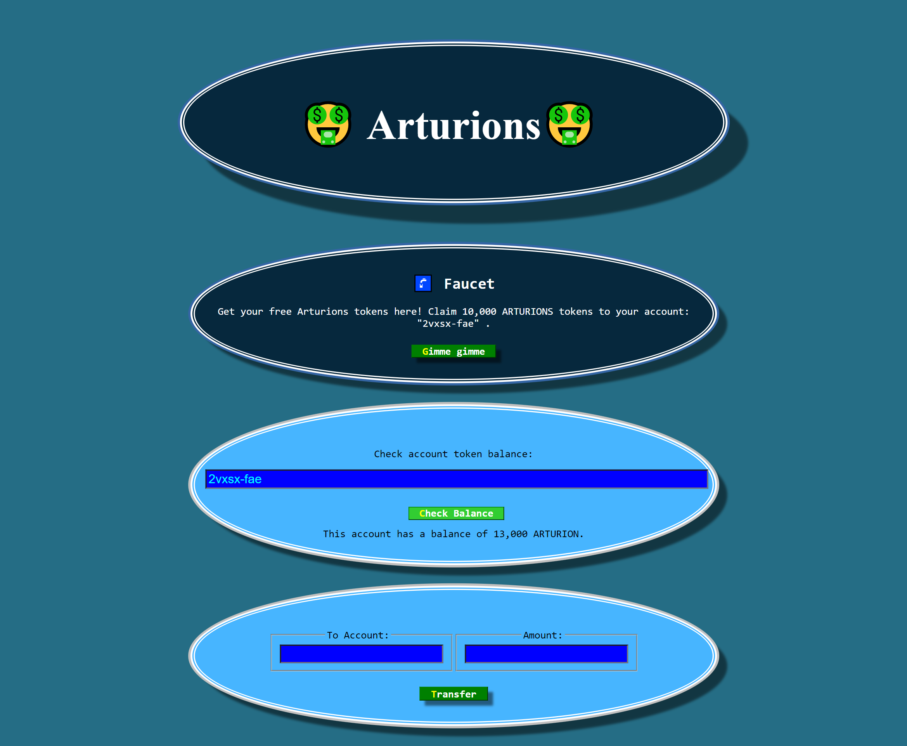
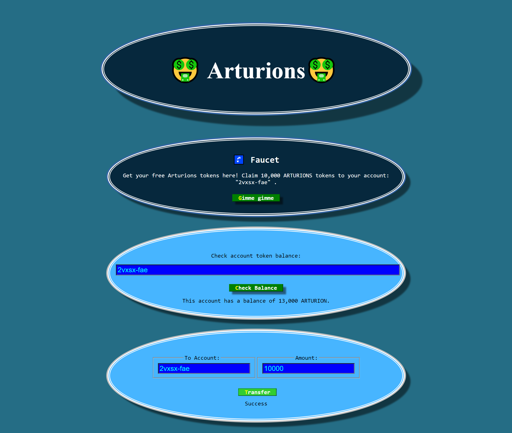
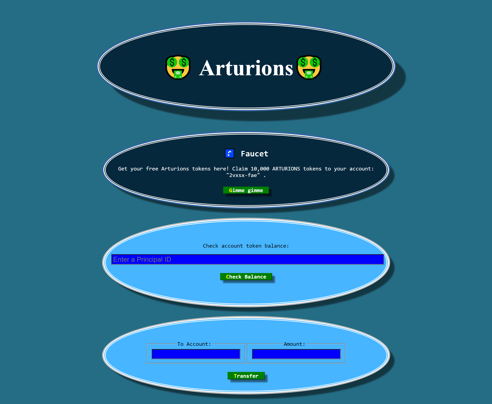

# token_04

Copyright 2023

The code in this tutorial project is licended under the Apache License, Version 2.0 (the "License");
you may not use this project except in compliance with the License.
You may obtain a copy of the License at

    http://www.apache.org/licenses/LICENSE-2.0

Unless required by applicable law or agreed to in writing, software
distributed under the License is distributed on an "AS IS" BASIS,
WITHOUT WARRANTIES OR CONDITIONS OF ANY KIND, either express or implied.
See the License for the specific language governing permissions and
limitations under the License.

Here is the TL;DR version of the above licence:
https://tldrlegal.com/license/apache-license-2.0-(apache-2.0)


This web app represents an example of creating your own token and how to implement it on a blockchain with the Iternet Computer. The token name is Arturion, and it will have the basic functionality of receiving and transferring tokens. The supply of tokens is hardcoded at 1 billion, and all of it will be transferred to the owner at the start of the canister. Before we start using the program, we need to specify the principal id of the owner in the main.mo file! Next, we want to use the canister to transfer money / payouts to the authenticated users (faucet functionality), so after the canister is running, we have to transfer tokens (from the owner account) to it from the command line (as described in the section "Charge the Canister"). Every user who visits the website will have the option of getting authenticated with their Internet identity by DFINITY (https://www.youtube.com/watch?v=oxEr8UzGeBo&ab_channel=DFINITY). After creating an anchor and being authorized, the user will be allowed to collect 10,000 tokens by pressing the Gime Gime button (only once). Each user's information and balance will be stored on the ledger. These tokens will be transferred from the main canister. This website will also give the option of transferring the tokens to a different account, but we have to specify the principal ID of the account to transfer. This web app is a great example of how to build decentralized apps with Internet Comuter, utilizing the Motoko programming language on the back end and React.js on the front end, and authenticating users with Internet Identity.   


---


To get started, you might want to explore the project directory structure and the default configuration file. Working with this project in your development environment will not affect any production deployment or identity tokens.

To learn more before you start working with token_04, see the following documentation available online:

- [Quick Start](https://internetcomputer.org/docs/current/developer-docs/quickstart/hello10mins)
- [SDK Developer Tools](https://internetcomputer.org/docs/current/developer-docs/build/install-upgrade-remove)
- [Motoko Programming Language Guide](https://internetcomputer.org/docs/current/developer-docs/build/cdks/motoko-dfinity/motoko/)
- [Motoko Language Quick Reference](https://internetcomputer.org/docs/current/references/motoko-ref/)
- [JavaScript API Reference](https://erxue-5aaaa-aaaab-qaagq-cai.raw.ic0.app)

If you want to start working on your project right away, you might want to try the following commands:

```bash
cd token_04/ 
dfx help
dfx canister --help
```

## Running the project locally

If you want to test your project locally, you can use the following commands:

```bash
# Starts the replica, running in the background
dfx start --background

# Deploys your canisters to the replica and generates your candid interface
dfx deploy
```

Once the job completes, your application will be available at `http://localhost:4943?canisterId={asset_canister_id}`.

Additionally, if you are making frontend changes, you can start a development server with

```bash
npm start
``` 
 
Which will start a server at `http://localhost:8080`, proxying API requests to the replica at port 4943.

### Note on frontend environment variables

If you are hosting frontend code somewhere without using DFX, you may need to make one of the following adjustments to ensure your project does not fetch the root key in production:

- set`NODE_ENV` to `production` if you are using Webpack
- use your own preferred method to replace `process.env.NODE_ENV` in the autogenerated declarations
- Write your own `createActor` constructor


---


# Useful commands: 

# Check your Balance

1. Find out your principal id:

```
dfx identity get-principal
```

2. Save it somewhere.

e.g. My principal id is: dsad-dasd-hnvqv-dasd-4kcfl-dasx-6khez-y56gq-uohqs-quomc-uqe


3. Format and store it in a command line variable:
```
OWNER_PUBLIC_KEY="principal \"$( \dfx identity get-principal )\""
```

4. Check that step 3 worked by printing it out:
```
echo $OWNER_PUBLIC_KEY
```

5. Check the owner's balance:
```
dfx canister call token_04_backend balanceOf "( $OWNER_PUBLIC_KEY )"
```

# Charge the Canister


1. Check canister ID:
```
dfx canister id token_04_backend
```

2. Save canister ID into a command line variable:
```
CANISTER_PUBLIC_KEY="principal \"$( \dfx canister id token_04_backend )\""
```

3. Check canister ID has been successfully saved:
```
echo $CANISTER_PUBLIC_KEY
```

4. Transfer half a billion tokens to the canister Principal ID:
```
dfx canister call token_04_backend transfer "($CANISTER_PUBLIC_KEY, 500_000_000)"
```

# Deploy the Project to the Live IC Network

1. Create and deploy canisters:

```
dfx deploy --network ic
```

2. Check the live canister ID:
```
dfx canister --network ic id token_04_backend
```

3. Save the live canister ID to a command line variable:
```
LIVE_CANISTER_KEY="principal \"$( \dfx canister --network ic id token_04_backend )\""
```

4. Check that it worked:
```
echo $LIVE_CANISTER_KEY
```

5. Transfer some tokens to the live canister:
```
dfx canister --network ic call token_04_backend transfer "($LIVE_CANISTER_KEY, 50_000_000)"
```

6. Get live canister front-end id:
```
dfx canister --network ic id token_04_frontend
```
7. Copy the id from step 6 and add .raw.ic0.app to the end to form a URL.
e.g. zdv65-7qaaa-aasasai-qibdq-cai.raw.ic0.app


---


**Examples of views from the website:**</br>


---


</br>


---


</br>


---


</br>


---
